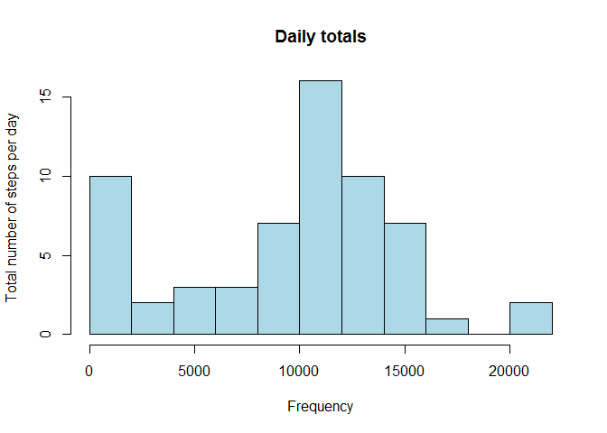

# Reproducible Research: Peer Assessment 1

## Loading and preprocessing the data

```r
setwd("c://users/liam/documents/r/datascience/reproducible research")
activity=data.frame(read.csv("activity.csv"))
activity$date=as.POSIXct(activity$date)
```
## What is mean (and media) total number of steps taken per day?

```r
totals <-  tapply(activity$steps, activity$date, function(data) sum(data, na.rm=TRUE))
par(mfrow=c(1,1))
hist(totals, ylab="Total number of steps per day", xlab="Frequency", col="lightblue", n=10, main="Daily totals")
```

 

The mean of daily total number of steps is 9354.2.

The median of daily total number of steps is 10395.

## What is the average daily activity pattern?

```r
daily.profile <- tapply(activity$steps, activity$interval, function(values) mean(values, na.rm=TRUE))
plot(daily.profile, type="l", xlab="Time of day in 5 minute units", ylab="Average number of steps")
```

 

The time of day at which the maximum number of steps occurred (on average) was the 104th 5 minute interval (out of 24*12). 

The number of rows in the database with missing values is 2304.

## Imputing missing values

We choose to use the specialised function *impSeq* from the package *rrcovNA* to impute missing values and then repeat the calculation of mean and median daily steps. 


```r
library(rrcovNA)
```

```
## Loading required package: rrcov
## Loading required package: robustbase
## Scalable Robust Estimators with High Breakdown Point (version 1.3-8)
## 
## Scalable Robust Estimators with High Breakdown Point for
## Incomplete Data (version 0.4-7)
```

```r
activity.imp <- data.frame(impSeq(data.frame(activity)))
class(activity.imp)
```

```
## [1] "data.frame"
```

```r
totals.imp <-  tapply(activity.imp$steps, activity.imp$date, function(data) sum(data, na.rm=TRUE))
par(mfrow=c(1,1))
hist(totals.imp, ylab="Imputed total number of steps per day", xlab="Frequency", col="lightblue", n=10, main="Imputed daily totals")
```

 

The mean daily total number of steps with imputed values is 10767.

The median of daily total number of steps with imputed values is 10781.

The difference in the mean from the version deleting NA data is 1413.

The difference in the median from the version deleting NA data is 386.

## Are there differences in activity patterns between weekdays and weekends?

```r
library(lattice)
#library(ggplot2)
weekends = weekdays(as.POSIXlt(activity.imp$date, origin="1970-1-1")) == "Sunday" | weekdays(as.POSIXlt(activity.imp$date, origin="1970-1-1")) == "Saturday"
weekend.char = (rep("", nrow(activity.imp)))
weekend.char[weekends] = "weekend"
weekend.char[!weekends] = "weekday"
activity.imp$weekend = as.factor(weekend.char)
weekday.profile <-  tapply(activity$steps[weekends], activity$interval[weekends], function(values) mean(values, na.rm=TRUE))
weekend.profile <-  tapply(activity$steps[!weekends], activity$interval[!weekends], function(values) mean(values, na.rm=TRUE))
panel.data = data.frame(daytype=c(rep("weekend", length(weekend.profile)), rep("weekday", length(weekday.profile))))
panel.data = cbind(panel.data, steps=c(weekend.profile, weekday.profile))
panel.data =cbind(panel.data, interval= activity$interval[1:(length(weekend.profile) + length(weekday.profile))])

xyplot(steps ~ interval | daytype, data = panel.data, layout = c(1, 2), type="l", xlab="Interval", ylab="Number of steps")
```

 

